# PrecepGo Agent Dashboard - Architecture

## System Architecture Diagram

```mermaid
graph TB
    subgraph "User Layer"
        USER[👤 Faculty/Program Director]
        BROWSER[🌐 Web Browser]
    end

    subgraph "Application Layer"
        DASHBOARD[📊 Dashboard UI<br/>HTML/JavaScript]
        FASTAPI[⚡ FastAPI Application<br/>main.py]
    end

    subgraph "Agent Layer - Google ADK"
        ROOT[🎯 Root Agent<br/>Coordinator]
        PIPELINE[🔄 Safety Pipeline<br/>Sequential Workflow]

        subgraph "Core Agents"
            EVAL[📝 Evaluation Agent<br/>7-step sequential]
            SCENARIO[🎯 Scenario Agent<br/>6-step sequential]
            NOTIFY[🚨 Notification Agent<br/>3-step sequential]
        end

        subgraph "Analytics Agents"
            COA[📋 COA Agent<br/>Compliance tracking]
            SITE[🏥 Site Agent<br/>Analytics]
            TIME[⏱️ Time Agent<br/>Metrics]
        end

        subgraph "Supporting Agents"
            IMAGE[🎨 Image Generator<br/>Imagen integration]
            STATE[💾 State Agent<br/>State management]
        end
    end

    subgraph "AI Services - Google Cloud"
        GEMINI[🤖 Gemini AI<br/>gemini-2.0-flash<br/>gemini-2.5-pro]
        IMAGEN[🎨 Vertex AI Imagen<br/>imagen-3.0]
        VECTOR[🔍 Vector Search<br/>RAG for medical content]
    end

    subgraph "Data Layer - Google Cloud"
        FIRESTORE[(🔥 Cloud Firestore)]
        STORAGE[(☁️ Cloud Storage<br/>Images)]

        subgraph "Firestore Collections"
            COLL_EVAL[agent_evaluations]
            COLL_SCEN[agent_scenarios]
            COLL_NOTIF[agent_notifications]
            COLL_COA[agent_coa_reports]
            COLL_SITE[agent_sites]
            COLL_TIME[agent_time_savings]
            COLL_IMG[agent_generated_images]
        end
    end

    subgraph "Static Data"
        JSON[📁 JSON Files<br/>students.json<br/>cases.json<br/>concepts.json<br/>templates.json]
    end

    %% User interactions
    USER --> BROWSER
    BROWSER --> DASHBOARD
    DASHBOARD -->|HTTP Requests| FASTAPI

    %% FastAPI to Agents
    FASTAPI -->|Orchestrates| ROOT
    FASTAPI -->|Direct calls| EVAL
    FASTAPI -->|Direct calls| SCENARIO
    FASTAPI -->|Direct calls| NOTIFY
    FASTAPI -->|Direct calls| COA
    FASTAPI -->|Direct calls| SITE
    FASTAPI -->|Direct calls| TIME

    %% Root Agent orchestration
    ROOT -->|Coordinates| PIPELINE
    PIPELINE -->|Step 1| EVAL
    PIPELINE -->|Step 2| NOTIFY
    PIPELINE -->|Step 3| SCENARIO

    %% Agent dependencies
    EVAL -->|Stores data| STATE
    SCENARIO -->|Uses| IMAGE
    SCENARIO -->|Reads data| STATE
    NOTIFY -->|Reads data| STATE
    COA -->|Reads data| STATE
    SITE -->|Reads data| STATE
    TIME -->|Tracks usage| STATE

    %% AI Service usage
    EVAL -->|Generates content| GEMINI
    SCENARIO -->|Generates content| GEMINI
    SCENARIO -->|RAG queries| VECTOR
    NOTIFY -->|Analyzes data| GEMINI
    COA -->|Aggregates data| GEMINI
    SITE -->|Generates insights| GEMINI
    IMAGE -->|Generates images| IMAGEN

    %% Data persistence
    STATE -->|Read/Write| FIRESTORE
    EVAL -->|Saves to| COLL_EVAL
    SCENARIO -->|Saves to| COLL_SCEN
    NOTIFY -->|Saves to| COLL_NOTIF
    COA -->|Saves to| COLL_COA
    SITE -->|Saves to| COLL_SITE
    TIME -->|Saves to| COLL_TIME
    IMAGE -->|Saves to| COLL_IMG
    IMAGE -->|Uploads images| STORAGE

    %% Static data usage
    JSON -->|Loaded by| FASTAPI
    FASTAPI -->|Provides to| EVAL
    FASTAPI -->|Provides to| SCENARIO

    %% Styling
    classDef userStyle fill:#e1f5fe,stroke:#01579b,stroke-width:2px
    classDef appStyle fill:#f3e5f5,stroke:#4a148c,stroke-width:2px
    classDef agentStyle fill:#e8f5e9,stroke:#1b5e20,stroke-width:2px
    classDef aiStyle fill:#fff3e0,stroke:#e65100,stroke-width:2px
    classDef dataStyle fill:#fce4ec,stroke:#880e4f,stroke-width:2px
    classDef staticStyle fill:#f1f8e9,stroke:#33691e,stroke-width:2px

    class USER,BROWSER userStyle
    class DASHBOARD,FASTAPI appStyle
    class ROOT,PIPELINE,EVAL,SCENARIO,NOTIFY,COA,SITE,TIME,IMAGE,STATE agentStyle
    class GEMINI,IMAGEN,VECTOR aiStyle
    class FIRESTORE,STORAGE,COLL_EVAL,COLL_SCEN,COLL_NOTIF,COLL_COA,COLL_SITE,COLL_TIME,COLL_IMG dataStyle
    class JSON staticStyle
```

## Data Flow Diagrams

### 1. Safety Pipeline Flow

### 2. Scenario Generation with Image Flow

### 3. Time Savings Analytics Flow

## Component Details

### Application Layer

#### FastAPI Application (`main.py`)
- **Purpose**: REST API server and agent orchestrator
- **Key Endpoints**:
  - `/dashboard` - Web UI
  - `/mentor/*` - Scenario & evaluation endpoints
  - `/agents/*` - Agent control endpoints
  - `/health` - Health check
- **Responsibilities**:
  - Route HTTP requests
  - Load static JSON data
  - Initialize agents
  - Manage agent lifecycle
  - Return responses

### Agent Layer

#### Root Agent
- **Type**: Coordinator agent
- **Purpose**: Entry point for multi-agent workflows
- **Sub-agents**: safety_pipeline
- **Model**: gemini-2.0-flash

#### Safety Pipeline (Sequential)
- **Purpose**: Complete student safety workflow
- **Steps**:
  1. Evaluation Agent - Create evaluation
  2. Notification Agent - Check for dangers
  3. Scenario Agent - Generate practice scenario
- **State sharing**: Passes data between agents

#### Evaluation Agent (Sequential - 7 steps)
- **Purpose**: Generate comprehensive student evaluations
- **Steps**:
  1. Load evaluation template
  2. Select target student
  3. Generate AC scores (13 metrics)
  4. Generate PC scores (11 metrics)
  5. Generate narrative feedback
  6. Create final evaluation document
  7. Save to Firestore
- **Model**: gemini-2.5-pro

#### Scenario Agent (Sequential - 6 steps)
- **Purpose**: Create personalized clinical scenarios
- **Steps**:
  1. Load scenario data
  2. Select case type
  3. Match patient template
  4. Select target student
  5. Generate scenario with Gemini
  6. Save to Firestore
- **Optional**: Image generation via Image Generator
- **Model**: gemini-2.5-pro

#### Notification Agent (Sequential - 3 steps)
- **Purpose**: Monitor student safety
- **Steps**:
  1. Check for dangerous ratings
  2. Generate notification email HTML
  3. Save notification to Firestore
- **Triggers on**: -1 ratings in evaluations
- **Model**: gemini-2.0-flash

#### COA Agent
- **Purpose**: Track COA Standard D compliance
- **Functions**:
  - Map evaluation metrics to COA standards
  - Aggregate student performance
  - Generate compliance reports
- **Model**: gemini-2.5-flash

#### Site Agent
- **Purpose**: Analyze clinical placement effectiveness
- **Functions**:
  - Identify high-performing preceptors
  - Track case distribution
  - Generate insights
- **Model**: gemini-2.5-flash

#### Time Agent
- **Purpose**: Calculate ROI and time savings
- **Functions**:
  - Track agent execution times
  - Calculate time saved vs manual
  - Generate analytics reports
- **Model**: gemini-2.0-flash

#### Image Generator
- **Purpose**: Create medical illustrations
- **Functions**:
  - Enhance prompts for medical context
  - Generate images via Imagen
  - Upload to Cloud Storage
  - Save metadata to Firestore
- **Model**: imagen-3.0-generate-001

#### State Agent
- **Purpose**: Centralized state management
- **Type**: Class-based (not ADK)
- **Functions**:
  - Store/retrieve agent state
  - Track execution status
  - Manage shared data

### AI Services

#### Gemini AI
- **Models Used**:
  - `gemini-2.0-flash` - Fast, low-cost
  - `gemini-2.5-pro` - High-quality, complex tasks
- **Use Cases**:
  - Content generation
  - Data analysis
  - Structured output
  - Medical reasoning

#### Vertex AI Imagen
- **Model**: imagen-3.0-generate-001
- **Use Case**: Medical image generation
- **Output**: Clinical scenario illustrations

#### Vector Search
- **Purpose**: RAG for medical content
- **Use Case**: Retrieve relevant medical information

### Data Layer

#### Cloud Firestore
**Collections:**
- `agent_evaluations` - Student evaluations
- `agent_scenarios` - Clinical scenarios
- `agent_notifications` - Safety alerts
- `agent_coa_reports` - Compliance reports
- `agent_sites` - Site analytics
- `agent_time_savings` - Time tracking
- `agent_generated_images` - Image metadata

#### Cloud Storage
- **Purpose**: Image storage
- **Bucket**: Configured via environment variable
- **Content**: Generated medical images
- **Access**: Public URLs

#### Static JSON Files
- `students.json` - Student roster
- `cases.json` - Clinical case types
- `concepts.json` - Medical concepts
- `templates.json` - Patient templates
- `standards.json` - COA standards
- `sites.json` - Clinical sites
- `task-time-benchmarks.json` - Time estimates

## Deployment Architecture

## Key Design Patterns

### 1. Sequential Agent Pattern
- Multiple agents execute in order
- Each step passes state to next
- Used for: Evaluations, Scenarios, Notifications

### 2. Coordinator Pattern
- Root agent orchestrates sub-agents
- Manages complex workflows
- Used for: Safety Pipeline

### 3. State Sharing Pattern
- Centralized state management
- Agents read/write shared context
- Enables data flow between agents

### 4. Tool Context Pattern
- ADK's ToolContext for state
- Agents access via `tool_context.state`
- Persistent across agent calls

## Scaling Considerations

### Current Architecture
- Single Cloud Run instance
- Stateless design (Firestore for persistence)
- Scales horizontally automatically

### Future Enhancements
- Redis for caching
- Pub/Sub for async workflows
- Cloud Tasks for scheduled jobs
- Load balancer for multiple regions

## Security

### Authentication
- Cloud Run allows unauthenticated (demo)
- Production: IAM, Firebase Auth, or OAuth

### Authorization
- Firestore security rules
- IAM roles for Cloud Storage
- API key for Gemini/Imagen

### Data Privacy
- PHI/PII considerations
- Encryption at rest (Firestore)
- Encryption in transit (HTTPS)

---

**Last Updated**: November 2024
